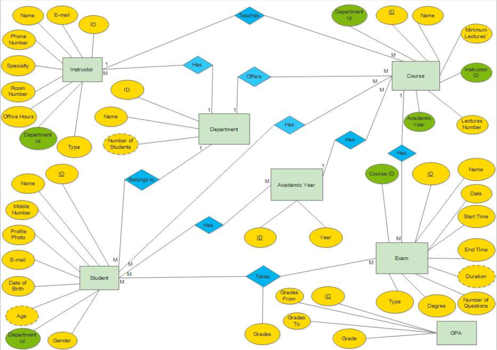

# University Database Project

This repository contains the implementation of a University database using SQL, including stored procedures, functions, and views. The project aims to model the various entities and relationships within a typical university environment.

This project is done during my internship at [Petra Software Ind.](https://www.t-petra.com/), you can check the [certificate](https://drive.google.com/file/d/1_yebgpazTYBhue7auYCAZrQT6afFn0z1/view).

## Table of Contents

- [University Database Project](#university-database-project)
  - [Table of Contents](#table-of-contents)
  - [Introduction](#introduction)
  - [ER Diagram](#er-diagram)
  - [Features](#features)
  - [Implementation Details](#implementation-details)
  - [Usage](#usage)
  - [Contributing](#contributing)

## Introduction

This project serves as a demonstration of building a relational database for a university setting. It encompasses the design and implementation of tables, relationships, stored procedures, functions, and views to manage university-related data efficiently.

## ER Diagram

The Entity-Relationship (ER) Diagram provides a visual representation of the database schema, illustrating the entities, attributes, and relationships involved.



## Features

- **Database Entities**: Define entities such as students, faculty, courses, departments, etc., with appropriate attributes.
- **Relationships**: Establish relationships between entities (e.g., students enroll in courses, faculty teach courses).
- **Stored Procedures**: Implement procedures to perform common database operations efficiently.
- **Functions**: Define functions to compute derived values or perform specific tasks.
- **Views**: Create views to present subsets of data or simplify complex queries.

## Implementation Details

The implementation includes the following components:

- **SQL Scripts**: Contains SQL scripts for creating tables, defining relationships, and implementing stored procedures, functions, and views.
- **ER Diagram**: Provides a visual representation of the database schema using an Entity-Relationship Diagram.

## Usage

To utilize the university database:

1. Clone the repository to your local machine.
    ```
    git clone git@github.com:mohamedhassan218/university-db.git
    ```

2. Execute the SQL scripts in your preferred database management system (e.g., MySQL, PostgreSQL) and see the results.

## Contributing

I welcome contributions from anyone. If you find any bugs or have suggestions for improvements, please feel free to open an issue or submit a pull request.

Feel free to take the code, customize it and try different ideas.